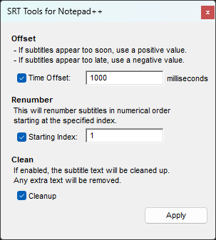

**SrtTools** is an SRT file plugin for Notepad++.

This tool makes it easy to edit SRT subtitle files directly inside Notepad++.

There are two main features:
- **Time Offset**: Shift the time codes of selected subtitles by a number of milliseconds.
- **Renumber**: Renumber the selected subtitles starting at a given index.

The plugin can also optionally cleanup the SRT file by removing extra characters not part of the SRT standard.

All the features are easily accessible from the tool's control dialog:

This plugin is under GPL.

Louis de Carufel (ldecarufel at hotmail.com)
